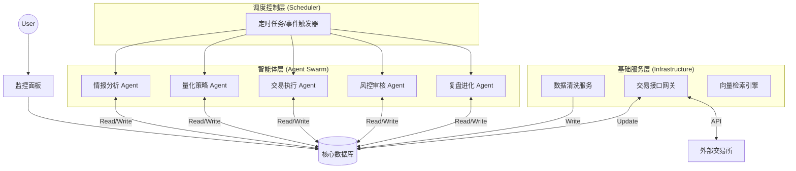

好的，这是一份完整的技术架构与开发文档（Markdown格式）。

这份文档以**“算法工程师/系统架构师”**的专业视角撰写，旨在指导开发团队落地一个**基于数据库中心化（Database-Centric）的长期运行多智能体交易系统**。

您可以直接复制以下内容保存为 `TradeSwarm_Architecture_Design.md`。

***

# TradeSwarm 系统架构设计文档

| 项目名称 | TradeSwarm (暂定) |
| :--- | :--- |
| **文档版本** | v1.0 (Initial Draft) |
| **文档状态** | **已评审 / 待开发** |
| **架构核心** | 数据库中心化 (Blackboard Pattern) + 多智能体协同 (Multi-Agent Swarm) |
| **目标场景** | 长期（周/月级）无人值守自动化交易与策略演化 |

---

## 1. 项目概述 (Overview)

### 1.1 背景与目标
本项目旨在构建一个基于大语言模型（LLM）的多智能体金融交易系统。与传统的量化框架或短期 Demo 不同，本系统的核心目标是**“长期生存”与“自我进化”**。
系统要求 Agent 能够连续运行数周至数月，期间所有的感知、决策、操作和反思必须完全持久化，以确保系统具备故障恢复能力（Crash Recovery）和基于历史经验的策略优化能力。

### 1.2 核心设计哲学
1.  **数据库即大脑 (Database is the Brain)**: Agent 程序本身是无状态（Stateless）的，所有“记忆”必须落地存储。
2.  **异步协作 (Asynchronous Collaboration)**: Agent 之间通过读写数据库表进行间接通信（黑板模式），而非点对点消息传递。
3.  **闭环反馈 (Feedback Loop)**: 引入“复盘机制”，利用向量数据库存储长期经验，形成 RAG（检索增强生成）回路。

---

## 2. 系统总体架构 (System Architecture)

系统采用四层架构设计，由下至上分别为：**数据持久层、基础服务层、智能体层、调度控制层**。

---

## 3. 数据库设计 (Database Schema Design)

这是系统的核心。为了支持混合查询，推荐使用 **关系型数据库 (Relational DB)** 配合 **向量插件**（如 PostgreSQL + pgvector），或采用“关系库 + 向量库”的双库方案。

### 3.1 结构化数据 (Structured Data)

#### A. `market_data` (市场行情)
*   存储清洗后的基础数据，作为 Agent 分析的客观依据。
*   **字段**: `symbol`, `timestamp`, `open`, `high`, `low`, `close`, `volume`, `technical_indicators (JSON)`

#### B. `agent_memory_stream` (思维链日志)
*   全量记录所有 Agent 的思考过程，用于调试和构建短期记忆。
*   **字段**:
    *   `log_id` (PK)
    *   `timestamp`
    *   `agent_role` (e.g., 'Quant', 'Trader')
    *   `thought_content` (Text: "我注意到均线金叉，且新闻情绪积极...")
    *   `action_type` (e.g., 'THINK', 'WRITE_SIGNAL')

#### C. `signals` (策略信号板)
*   量化分析师产出的中间结果，供交易员读取。
*   **字段**:
    *   `signal_id` (PK)
    *   `generated_at`
    *   `symbol`
    *   `direction` (LONG/SHORT/HOLD)
    *   `confidence_score` (0.0 - 1.0)
    *   `reasoning_summary` (Text: 信号生成的简述)
    *   `status` (NEW / PROCESSED / EXPIRED)

#### D. `orders` (订单执行表)
*   交易员生成的具体操作指令。
*   **字段**:
    *   `order_id` (PK)
    *   `created_at`
    *   `symbol`, `side` (BUY/SELL), `quantity`
    *   `order_type` (MARKET/LIMIT)
    *   `status` (PENDING_RISK_REVIEW -> APPROVED -> FILLED / REJECTED)
    *   `risk_comment` (风控 Agent 的批注)

#### E. `portfolio_snapshot` (资产快照)
*   每日/每小时的资产净值记录，用于计算收益率。

### 3.2 非结构化/向量数据 (Vector Data)

#### F. `knowledge_base` (外部信息)
*   存储新闻、研报摘要。
*   **字段**: `content_text`, `embedding_vector`, `timestamp`, `source`.

#### G. `experience_memory` (长期经验)
*   复盘 Agent 生成的经验教训。
*   **字段**: `reflection_text` ("在震荡市追高导致亏损..."), `embedding_vector`, `market_condition_tag`.
*   **用途**: 下次生成信号前，先根据当前市场状态检索相似的历史教训。

---

## 4. 智能体角色定义 (Agent Roles & Logic)

基于 LangChain/LangGraph 框架开发，每个 Agent 遵循 **ReAct (Reason + Act)** 模式。

### 4.1 情报员 (Info Scout)
*   **职责**: 广度扫描。
*   **输入**: 互联网新闻 API、社交媒体。
*   **处理**: 使用 LLM 进行摘要提取和情感打分。
*   **输出**: 写入 `knowledge_base` 表。

### 4.2 量化分析师 (Quant Analyst)
*   **职责**: 深度分析与信号生成。
*   **工具**: `QueryMarketData`, `SearchNews(RAG)`。
*   **逻辑**:
    1.  从 DB 拉取最近 N 小时行情。
    2.  检索最近 N 条高相关新闻。
    3.  检索 `experience_memory` (长期记忆)："我以前在这种行情下犯过错吗？"
    4.  综合判断，生成 JSON 格式信号。
*   **输出**: 写入 `signals` 表。

### 4.3 交易员 (Trader)
*   **职责**: 资金管理与执行。
*   **工具**: `QuerySignal`, `CheckPortfolio`。
*   **逻辑**:
    1.  轮询 `signals` 表中 `status=NEW` 的记录。
    2.  查询当前现金与持仓。
    3.  决定仓位大小 (Position Sizing)。
*   **输出**: 写入 `orders` 表 (状态设为 PENDING)。

### 4.4 风控经理 (Risk Manager)
*   **职责**: 守门员。
*   **逻辑**: 混合逻辑 (Hybrid Logic)。
    *   *Hard Rules (代码)*: 单笔亏损限额、最大持仓比例。
    *   *Soft Rules (LLM)*: 审查 Trader 的理由是否过于激进或产生幻觉。
*   **输出**: 更新 `orders` 表状态为 `APPROVED` 或 `REJECTED`。

### 4.5 复盘观察员 (Reviewer) - *长期运行的关键*
*   **职责**: 自我进化。
*   **触发**: 每日收盘后。
*   **逻辑**:
    1.  对比 `signals` (预测) 和 `market_data` (实际走势)。
    2.  计算当日 PnL。
    3.  LLM 生成反思："今日盈利是因为运气还是逻辑？亏损是因为止损太慢吗？"
*   **输出**: 将反思存入 `experience_memory` 向量表。

---

## 5. 工作流与调度 (Workflow & Scheduling)

系统采用**时间片驱动 (Time-Slicing)** 模式运行。

1.  **T+0 09:00 (数据准备)**
    *   Scheduler 启动数据服务，更新隔夜外盘数据与新闻入库。
2.  **T+0 09:30 - 15:00 (盘中循环)**
    *   每 15/30 分钟触发一次 `Run_Analysis_Cycle`:
        *   Analyst 读库 -> 写信号。
        *   Trader 读信号 -> 写订单。
        *   Risk 读订单 -> 审批。
        *   Execution Engine 扫描审批单 -> 发送交易所。
3.  **T+0 15:30 (盘后清算)**
    *   更新 `portfolio_snapshot`。
    *   启动 Reviewer Agent 进行深度复盘，更新向量库。
    *   启动 **Memory Compressor**：将当日的 `agent_memory_stream` 压缩为摘要，防止上下文无限膨胀。

---

## 6. 关键技术规范

### 6.1 LLM 交互规范
*   **Structured Output**: 涉及写库的操作（如生成信号、订单），必须强制 LLM 输出 JSON 格式，并使用 Pydantic 进行校验，失败则重试。
*   **Context Management**: 严禁将整个数据库塞入 Prompt。必须使用 SQL 查询或 Vector Search 获取最相关片段。

### 6.2 异常处理
*   **网络异常**: 由于状态持久化，网络中断后，Agent 重启时只需读取数据库中 `status=PENDING` 的任务继续执行即可。
*   **幻觉抑制**: Agent 禁止直接回答“现在股价是多少”，必须调用 `lookup_price` 工具获取数据。

---

## 7. 待定事项 (TBD)
*   [ ] 选定具体的数据库技术栈 (PostgreSQL vs MySQL+Milvus)。
*   [ ] 确定接入的交易所/券商 API 及回测沙箱环境。
*   [ ] 确定 LLM 模型选型 (GPT-4 用于决策, Llama-3 用于日常分析以降低成本)。

---
*文档结束*