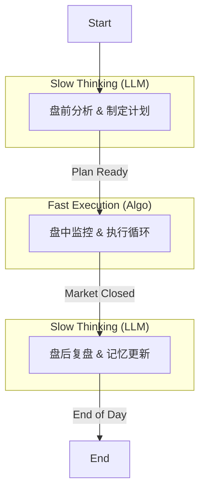

# 混合架构设计：慢思考 (LLM) 与 快执行 (Algo)

## 1. 核心理念

本设计旨在解决 LLM 在高频/实时交易中的延迟与成本问题，采用 **"LLM 负责战略（慢思考），规则/算法负责战术（快执行）"** 的混合模式。

系统通过 `conditional_edge` 将交易流程严格划分为三个阶段：

1.  **盘前 (Pre-Market)**: LLM 分析历史与宏观，制定结构化策略。
2.  **盘中 (Intraday)**: 纯 Python 算法根据策略监控分钟级数据，执行交易（无 LLM 介入）。
3.  **盘后 (Post-Market)**: LLM 复盘执行结果，更新记忆，判断策略有效性。

---

## 2. 详细流程设计

### 阶段一：盘前战略 (Pre-Market Strategy) —— LLM 主导

*   **触发时机**: 开盘前 (e.g., 09:00 - 09:25)。
*   **输入数据**:
    *   历史行情 (Daily OHLCV)。
    *   宏观/行业新闻。
    *   `FinancialSituationMemory` (长期记忆，包含过往策略表现)。
*   **参与节点**: Fusion Node, Research Subgraph, Risk Subgraph。
*   **核心产出**: `ExecutionPlan` (结构化执行计划)。
*   **逻辑**:
    *   LLM 不直接下达 "买入/卖出" 指令，而是选择一个 **策略模板** 并填充 **参数**。
    *   例如：选择 "均线突破策略"，设定 "突破 MA20 买入，止损 -2%，止盈 +5%"。

#### ExecutionPlan 数据结构示例
```json
{
  "target_symbol": "000001.SZ",
  "direction": "long", // long, short, hold
  "strategy_id": "breakout_ma_v1", // 预定义的策略ID
  "parameters": {
      "trigger_condition": "price > ma_20",
      "buy_limit_price": 12.50, // 最高买入价
      "stop_loss_price": 11.80, // 硬止损
      "take_profit_price": 13.50, // 止盈位
      "position_size_pct": 0.2, // 仓位占比
      "max_holding_time_mins": 240 // 最大持仓时间
  },
  "validity_factors": [
      {"factor": "rsi_14", "condition": "< 70"},
      {"factor": "volume_ratio", "condition": "> 1.2"}
  ],
  "expiration": "15:00:00" // 计划有效期
}
```

---

### 阶段二：盘中执行 (Intraday Execution) —— 纯算法 (No LLM)

*   **触发时机**: 交易时段 (09:30 - 11:30, 13:00 - 15:00)。
*   **输入数据**:
    *   `ExecutionPlan` (来自上一阶段)。
    *   实时分钟级行情 (Realtime Minute Bar)。
*   **执行机制**:
    *   这是一个 **Tool Node** 或 **外部循环**，**严禁调用 LLM**。
    *   **监控**: 每分钟获取最新 K 线和因子数据。
    *   **触发**: 
        *   `if current_price > plan.trigger_condition and factors_valid(): execute_trade()`
        *   `if current_price < plan.stop_loss_price: execute_stop_loss()`
    *   **风控**: 实时计算浮动盈亏，强制执行硬止损。
*   **核心产出**: `ExecutionLog` (执行日志)。

#### ExecutionLog 数据结构示例
```json
[
  {
    "timestamp": "2025-12-12 10:15:00",
    "action": "buy",
    "price": 12.10,
    "volume": 1000,
    "reason": "trigger_hit: price(12.10) > ma_20(12.05)"
  },
  {
    "timestamp": "2025-12-12 14:30:00",
    "action": "sell",
    "price": 11.75,
    "volume": 1000,
    "reason": "stop_loss_hit: price(11.75) < stop_loss(11.80)",
    "pnl": -350.0
  }
]
```

---

### 阶段三：盘后复盘 (Post-Market Review) —— LLM 主导

*   **触发时机**: 收盘后 (15:00+)。
*   **输入数据**:
    *   `ExecutionLog` (盘中发生了什么)。
    *   当日日线收盘数据 (Daily Close)。
*   **核心任务**:
    1.  **归档**: 将当日日线数据存入 Memory。
    2.  **评估**: 
        *   策略是否按计划执行？
        *   策略是否失效？(e.g., 震荡市中突破策略频繁止损)。
    3.  **决策**:
        *   **Keep**: 策略有效，明日继续使用（可能微调参数）。
        *   **Switch**: 策略失效，建议更换策略或因子。
        *   **Halt**: 市场环境恶劣，建议空仓。
*   **产出**: 更新后的 `FinancialSituationMemory`。

---

## 3. 状态管理 (State Management)


```python
class FusionState(MessagesState):
、
    # 1. 市场阶段标记 (用于 Conditional Edge 路由)
    market_phase: Literal["pre_market", "intraday", "post_market"]
    
    # 2. 盘前生成的策略计划
    execution_plan: Optional[dict]
    
    # 3. 盘中产生的执行日志
    execution_log: List[dict]
    
    # 4. 盘后复盘结论 (用于指导第二天)
    strategy_review: Optional[str]
```

## 4. 图结构 (Graph Topology)


